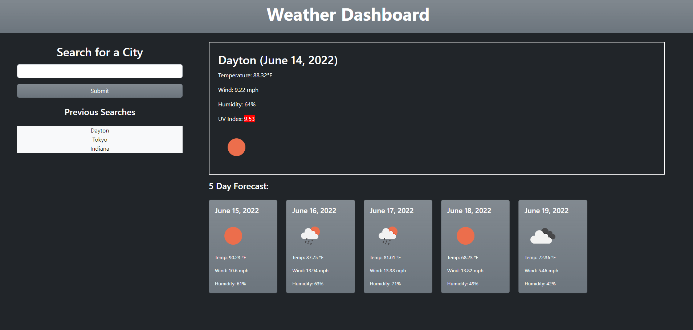

# Lucas-Saaler-Weather-Forecaster

## Description

This website will allow the user to search for the weather of any city and see a current and 5-day forecast.

## Table of Contents (Optional)

- [Usage](#usage)
- [Credits](#credits)
- [License](#license)

## Usage

When you first launch the website, it will appear largely blank, save for a search section and a box for the current forecast. Using the search bar will prompt the website to come to life, and you will be given a current forecast as well as a 5-day forecast for the city you are searching. Additionally, you will be able to refer back to previously searched locations via the "Previous Searches" section. from there, you can click any past location you have searched for, and it will pull up the forecast.

*There is a slight issue with this feature that I intend to polish in the future: the locally stored searches don't automatically populate when you search a new location; you need to refresh the page in order to have those appear. The local storage works, as does the click feature; however, I am running short on time for this assignment, so I wasn't able to get it to populate fully automatically, and it wasn't for a lack of trying.*

You can find the deployed page here: https://lucas-saaler.github.io/Lucas-Saaler-Weather-Forecaster/

## Credits

I coded this all myself, using bootstrap, moment.js, and the open weather API, along with regular javascript, HTML, and CSS.

## License

